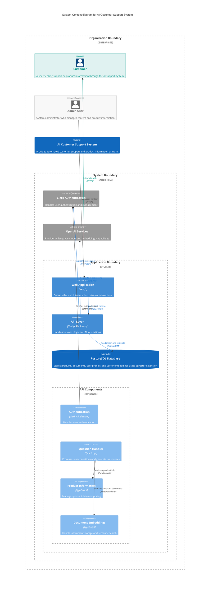

```mermaid
C4Context
title System Context diagram for AI Customer Support System

Enterprise_Boundary(orgBoundary, "Organization Boundary") {
    Person(customer, "Customer", "A user seeking support or product information through the AI support system")
    Person_Ext(adminUser, "Admin User", "System administrator who manages content and product information")

    System(supportSystem, "AI Customer Support System", "Provides automated customer support and product information using AI")

    Enterprise_Boundary(systemBoundary, "System Boundary") {
        System_Ext(clerk, "Clerk Authentication", "Handles user authentication and management")
        System_Ext(openai, "OpenAI Services", "Provides AI language model and embeddings capabilities")

        System_Boundary(appBoundary, "Application Boundary") {
            Container(web, "Web Application", "Next.js", "Delivers the web interface for customer interactions")
            Container(api, "API Layer", "Next.js API Routes", "Handles business logic and AI interactions")
            
            Boundary(componentBoundary, "API Components", "component") {
                Component(auth, "Authentication", "Clerk middleware", "Handles user authentication")
                Component(questionHandler, "Question Handler", "TypeScript", "Processes user questions and generates responses")
                Component(productInfo, "Product Information", "TypeScript", "Manages product data and pricing")
                Component(docEmbed, "Document Embeddings", "TypeScript", "Handles document storage and semantic search")
            }

            SystemDb(db, "PostgreSQL Database", "Stores products, documents, user profiles, and vector embeddings using pgvector extension")
        }
    }
}

BiRel(customer, web, "Interacts with", "HTTPS")
Rel(web, api, "Makes API calls to", "JSON/HTTPS")
Rel(api, clerk, "Authenticates users", "HTTPS/API")
Rel(api, openai, "Requests AI processing", "HTTPS/API")
Rel(api, db, "Reads from and writes to", "Prisma ORM")
Rel(adminUser, web, "Manages content", "HTTPS")

Rel(questionHandler, productInfo, "Retrieves product info", "Function call")
Rel(questionHandler, docEmbed, "Searches relevant documents", "Vector similarity")
Rel(auth, clerk, "Verifies authentication", "HTTPS/API")

UpdateElementStyle(customer, $fontColor="#009688", $bgColor="#E0F2F1", $borderColor="#009688")
UpdateElementStyle(adminUser, $fontColor="#707070", $bgColor="#F8F8F8", $borderColor="#707070")

UpdateRelStyle(customer, web, $textColor="#009688", $lineColor="#009688")
UpdateRelStyle(web, api, $textColor="#1976D2", $lineColor="#1976D2")
UpdateRelStyle(api, clerk, $textColor="#1976D2", $lineColor="#1976D2")
UpdateRelStyle(api, openai, $textColor="#1976D2", $lineColor="#1976D2")
UpdateRelStyle(api, db, $textColor="#1976D2", $lineColor="#1976D2")

UpdateLayoutConfig($c4ShapeInRow="3", $c4BoundaryInRow="1")
``` 